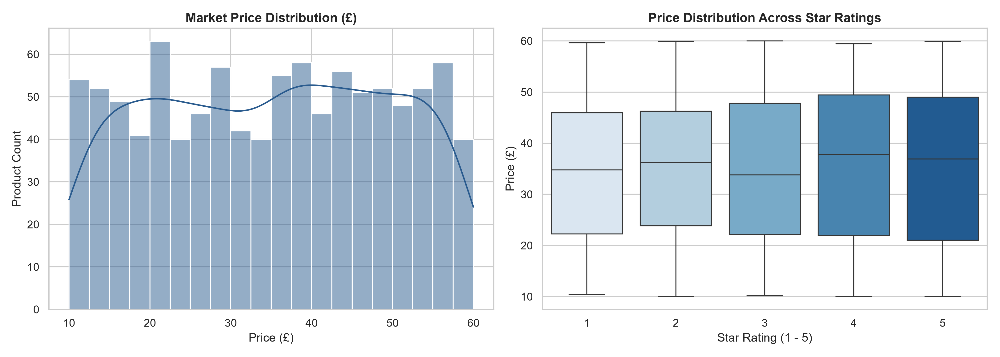

# Market Web Scraper & Price Intelligence Pipeline

An end-to-end Python pipeline that automates web data extraction, text cleaning using Regular Expressions, relational database persistence, and statistical market intelligence analysis.

## Market Analysis Visualizations

## Tech Stack & Architecture
- **Web Scraping:** `requests`, `BeautifulSoup` (multi-page traversal, HTML tag parsing).
- **Data Wrangling:** `pandas`, `re` (Regex currency extraction, rating normalization, type casting).
- **Database:** `sqlite3` (schema persistence and query integration).
- **Visualization & Stats:** `matplotlib`, `seaborn` (KDE price distributions, IQR boxplots).

## Pipeline Execution
1. Run `python full_pipeline.py` to scrape 1,000 items from 50 catalogue pages and populate `market_intelligence.db`.
2. Run `python analyze_market.py` to execute SQL analytical queries and output distribution metrics and charts.
